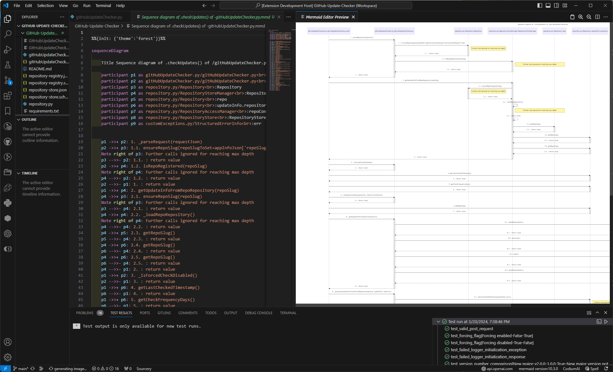

# PySequenceReverse

This extension for VS Code enables you to create UML-compliant Mermaid sequence diagrams from Python code to perform reverse engineering and to gain more knowledge about a piece of code.

## Legal Stuff

[MIT license](/LICENSE) applies, so it's all free and open. Donation options available in the [repo](https://github.com/gusztavj/PySequenceReverse) to support further development.

### Credits

This work is loosely based on [VS Code Chartographer](https://github.com/arpinfidel/vscode-chartographer), the call graph creating extension from _Richard Putra_.

Thanks for the valuable advices of [arpicheck](https://github.com/arpicheck).

## Features

* Create UML-compliant sequence diagram for any function in [Mermaid language](https://mermaid.js.org/)
* Limit call depth to have higher-level diagrams
* Ignore calls you don't need
* Ignore calls to 3rd party packages, as well as physical and virtual Python environments
* Automatically view created diagrams for preview using [Mermaid Editor](https://marketplace.visualstudio.com/items?itemName=tomoyukim.vscode-mermaid-editor) from [tomoyukim](https://marketplace.visualstudio.com/publishers/tomoyukim)
* Automatically save created diagrams (in the format and to the location you set in **Mermaid Editor**)

## How to Use?

1. Click in or point to a function's name.
1. Either
   * Right-click and select `PySequenceReverse: Create diagram for this function`

     or

   * Hit `Ctrl+Shift+P` and start typing `**PySequenceReverse: Create diagram for this function**`, the hit it, too.

1. Wait for the diagram to be created and watch out for status messages.

If [automated saving](#save-diagram-automatically-rather-than-asking-for-a-file-name) and [automatically opening](#open-saved-diagram-automatically-if-supported-previewer-extension-is-installed) diagrams are both enabled, you'll be presented with the diagram once the operation completes. If auto-save is not enabled, first you'll need to save the diagram.

## Configuration Settings

In VS Code, click `File > Preferences > Settings`, select `User` or `Workspace`, expand `Extensions` and select `PySequenceReverse` to view and edit settings:

### Glob patterns of files to ignore when fetching call hierarchy for the call graph

List file patterns. Files matching these patterns won't be analyzed. If a call targets an item in such a file, it won't be added to the diagram. Use this to ignore calls that are not of much value or only distract the reader. Logging methods may be a typical example.

### Ignore files that are not part of the current workspace

Limit code analysis to the current VS Code workspace. Calls targeting anything out of it won't be added to the diagrams. You can use this to not analyze third-party packages.

### Don't analyze files/functions located in the physical or virtual environments (3rd party packages)

With this self-explanatory setting. This includes folders named `.venv` and `.conda`, as well as the Python path set in VS Code Settings, as well as the values set in the `Venv folders` and `Venv Path` settings of Python in VS Code Settings.

### Save diagram automatically rather than asking for a file name

When checked, each diagram you create will be saved automatically to the workspace's root folder, with the file name composed of the name of the function, its containing class or module and workspace-relative path. When not checked, you'll be presented with a dialog to select a location and specify a name for the file.

### Open saved diagram automatically (if supported previewer extension is installed)

When checked, the diagram saved automatically or manually will be displayed in VS Code after successful save if [Mermaid Editor](https://marketplace.visualstudio.com/items?itemName=tomoyukim.vscode-mermaid-editor) is installed.

### Maximum call depth (1 to 32)

Only up this level of nesting will calls be detailed to let you control the amount of information and level of complexity you tolerate on a diagram. When limited depth is reached and there are further function calls to deeper levels, instead of gathering them, a note will let you know next to the relevant method that further details are cut. This way you'll know where to go for further details if you need any.

## Requirements

**PySequenceReverse** relies on the "call hierarchy" feature of an LSP server. So, to use **PySequenceReverse** for your project analysis, you must have a language server extension that supports "call hierarchy."

 [Mermaid Editor](https://marketplace.visualstudio.com/items?itemName=tomoyukim.vscode-mermaid-editor) from [tomoyukim](https://marketplace.visualstudio.com/publishers/tomoyukim) is required to view **Mermaid** diagrams.

## For more information

Support, bug reports, feature requests and other stuff in the [GitHub repo](https://github.com/gusztavj/PySequenceReverse).
